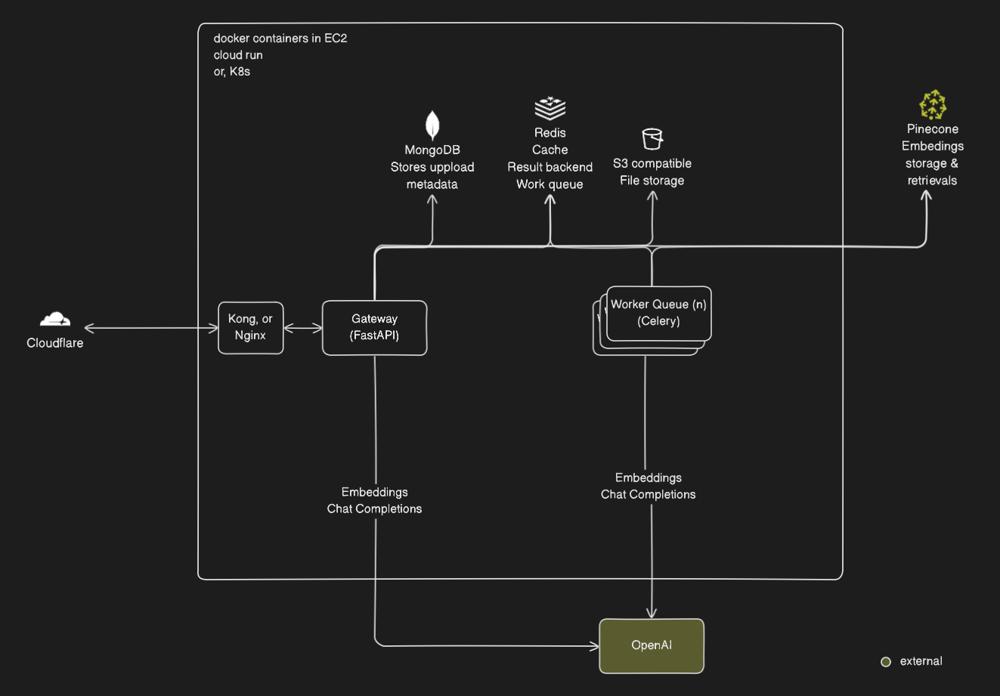
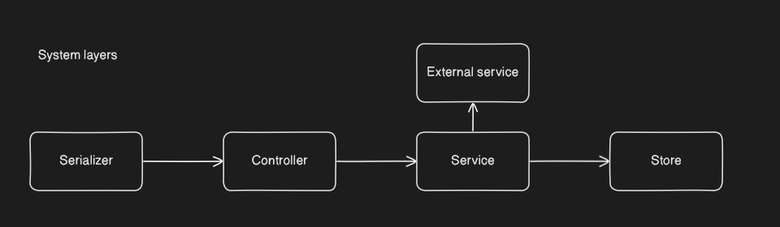

# Gateway Challenge
The application is live at [https://gateway.lodimup.com/docs](https://gateway.lodimup.com/docs)
- file upload apart from provided sample files are disabled
# System Design

There are two main components in the system:
- **Gateway**: The gateway is the entry point for all incoming requests. It is responsible for routing the requests to the appropriate service.
- **Worker**: The workers are responsible for processing long running requests and returning the response to the gateway. The result, and queue status are stored in Redis.
- **MongoDB**: Is used to store uploaded file metatdata such OCR state, md5 hashes, ownership etc. see `app.services.db.IUploads`
- **Redis**: Is used for caching, primarily for rate limiting. It is also used for task queueing by Celery worker
- **Bucket**: Is used to store the uploaded files.
- **Nginx**: Is used as a reverse proxy to route requests to the gateway, this allows horizontal scaling of Gateway.
- **Pinecone**: Is used to store embeddings and metadata of uploaded files. This is used for similarity search.
- **OpenAI**: Is used to generate embedding vectors and generate netural language response.
## File Storage
when a file is uploaded it is stored in a bucket. The metadata is stored in MongoDB. MD5 hash, id, and user_id is used to identify the file and ownership. These metadata are stored:
id, file extension, md5 hash, file name, url, user_id, ocr_status, schema_version
Since we use MongoDB, schema version is used to track changes in the schema. This is used to ensure that the data is consistent.
## OCR and embedings
OCR and embedding is done by the worker. The worker is responsible for processing long running tasks. The worker will download the file from the bucket, process it and store the result in MongoDB and Pinecone. The worker will also update the metadata in MongoDB with the status of the OCR and embedding. The query embbedding could be persisted.
## Task Queue
Endpoint that request long running tasks will return task_id which can be used to check task status.
## Extraction
Extraction is done by embedding the query and query pinecone for similar embeddings. The result is then converted to natural language for furthur processing.
## System Layers

System is divided into 5 layers:
- **Serializer**: Ensures that the incoming request is in the correct format. It also ensures that the response is in the correct format.
- **Controller**: The controller is responsible for handling the incoming request and sending it to the appropriate service.
- **Service**: The service is responsible for processing the request. It can call other services or the database. Ihis include task queue.
- **Store**: The database is responsible for storing and retrieval of the data.
- **Eternal service**: The external layer is responsible for handling external services like Pinecone, OpenAI etc.
# Usage
There is a Makefile for your convenience, check it out for more commands.

**Running services locally requires**
- docker
- GNU Make
pinecone database can be initialized with the following command once
```
python scripts/init_pinecone.py
```
make compose-up
```
Access the API at `http://localhost:8000/docs`
**Running tests**
```
make compose-test
```
# Local Development in devcontainers
## Development
Requires:
- docker
- vscode with remote containers extension installed
- .env file in the root directory with correct values

A devcontainer is preconfigured for your convenience. Simply `CTRL+SHIFT+P or CMD+SHIFT+P` and select `Remote-Containers: Reopen in Container`.  
You will start working in a docker container with tools and requires dependencies pre-installed. Envronment variable will be reloaded each time you open a new terminal. Makefile is provided for convenience. All database will also be up and running. Check with `docker ps`
Make sure you're in devcontainer by running the following command
```
lsb_release -a
```
Once in container you can start dev server with
```
fastapi dev
```
You can run unit tests locally with
```
cd .. && make test
```
## Releasing
Once your PR is merged, you can release the code to a docker image by running the following command
```
make release
```
A tag will be pushed to the repository, then the image will be built and pushed to the registry. https://github.com/Lodimup/gateway-challenge/pkgs/container/gateway-challenge

## CI/CD
The CI/CD pipeline is setup with Github Actions. It will run tests on each PR and deploy to the registry on PRs and pushes.
- **Linting** is done with `Ruff`
- **Testing** is done with `pytest`
- **Docker** image is built and pushed to the registry when a git tag is pushed.
To deploy to production you can use `docker-compose.yml` as a template


# Endpoints
Automatic documentation, and example usage is available at [http://localhost:8000/docs](http://localhost:8000/docs) locally and [https://gateway.lodimup.com/docs](https://gateway.lodimup.com/docs) on cloud.
